# AWS 3-Tier Architecture (EC2, RDS, EFS, S3, CloudFront, ALB, Route 53)

This project showcases a production-ready 3-tier architecture on AWS using EC2 (NGINX), RDS (MySQL), and EFS. It integrates CloudFront, ALB, and Route 53 for scalability and content delivery.

---

##  Architecture Overview

- **VPC with Public & Private Subnets (2 AZs)**
- **Web/Application Layer:** EC2 with NGINX (Auto Scaling behind ALB)
- **Data Layer:** Amazon RDS (MySQL) with Read Replica
- **Storage:** EFS mounted to EC2 for persistent shared content
- **Static Assets:** Delivered using S3 + CloudFront + Route 53

---

##  IAM Overview

- EC2 role: Access to S3 (read), EFS (mount)
- EFS access point: Mount restricted to EC2 role
- S3 bucket: Accessed via CloudFront Origin Access Control (OAC)

---

##  Services Used

- VPC, Subnets, Route Tables, IGW
- EC2, NGINX, AMI, Launch Template, Auto Scaling Group
- EFS, RDS + Read Replica
- Application Load Balancer (ALB)
- S3 (private) + CloudFront + Route 53 DNS
- IAM (for EC2 S3/EFS access)
- ACM (SSL Certificate)

---

##  Step-by-Step Project Flow

### 1️ VPC & Networking Setup

- Created VPC `10.0.0.0/16`
- 2 public + 2 private subnets across 2 AZs
- Internet Gateway + route tables
- Security Groups:
  - ALB (port 80)
  - EC2 Web (HTTP from ALB, SSH from My IP)
  - RDS (port 3306 from EC2 SG)
  - EFS (port 2049 from EC2 SG)

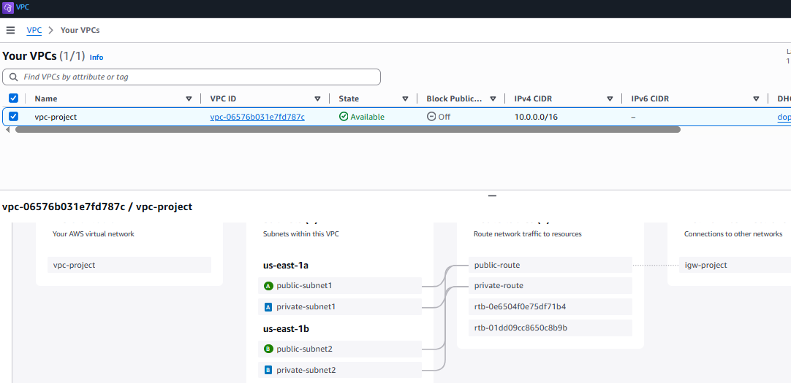  
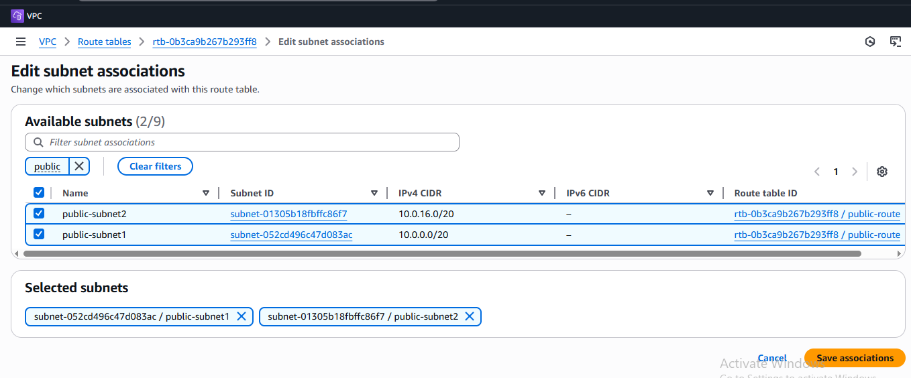

---

### 2️ EC2 Web Server (NGINX Setup)

- Launched EC2 instance in public subnet
- Installed NGINX via user-data
- Unlinked default site and created custom config at `/etc/nginx/sites-available/eleti.site`
- Verified test HTML from EC2 public IP

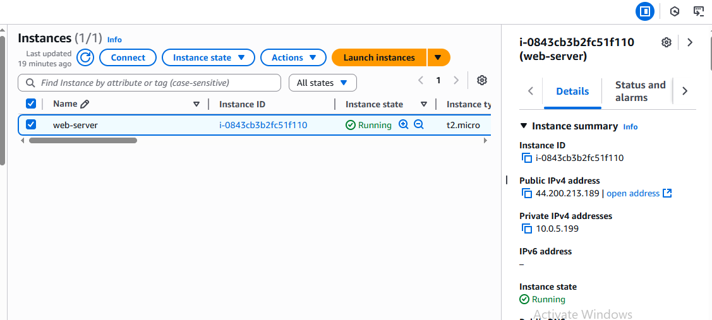  
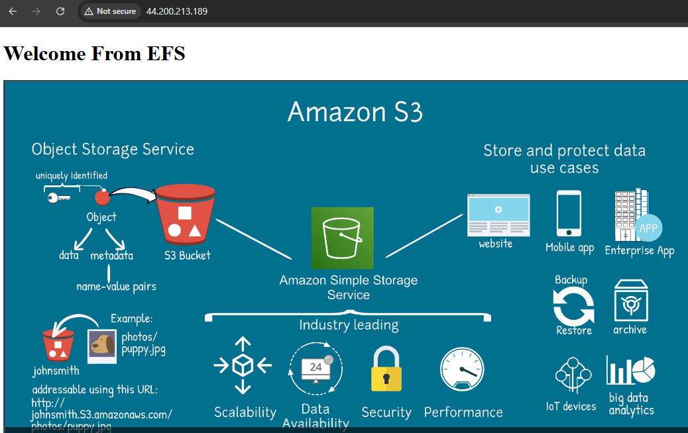

---

### 3️ Mount EFS to EC2

- Created EFS with mount targets in both AZs
- Installed `nfs-common`, mounted EFS at `/var/www/eleti.site`
- Served static HTML (including CloudFront image) via NGINX

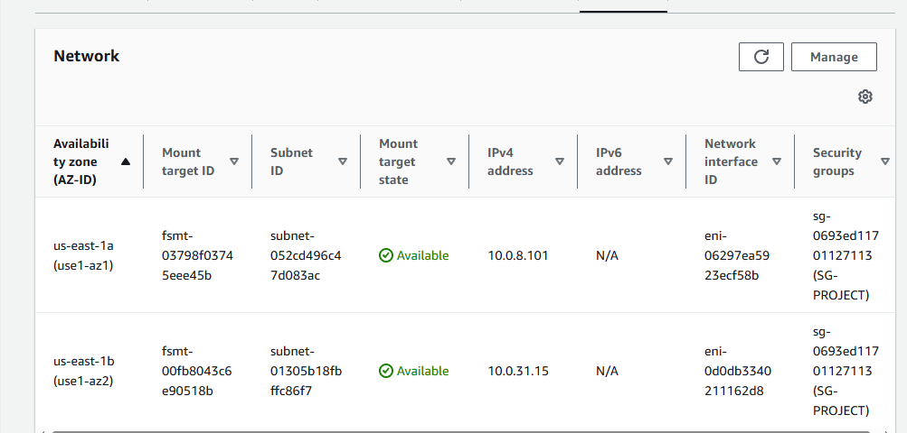

---

### 4️ RDS + Read Replica

- Created MySQL RDS in private subnet
- Connected from EC2 using `mysql-client`
- Created **Read Replica** for HA

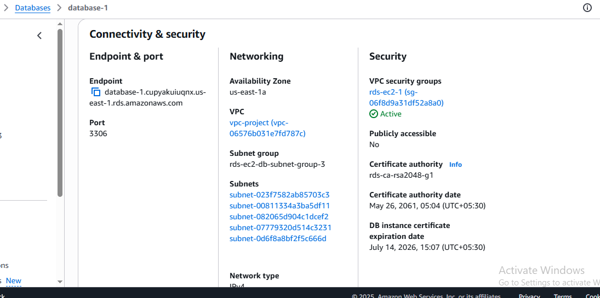  
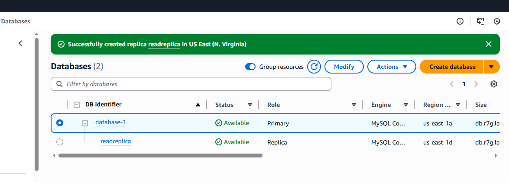  
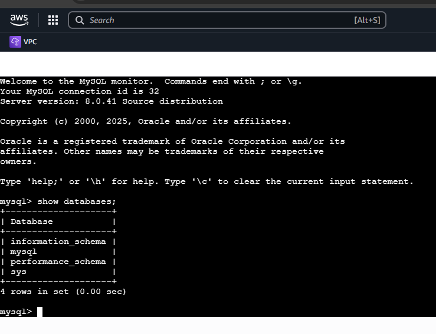

---

### 5️ AMI, Launch Template & Auto Scaling

- Created AMI from EC2
- Created Launch Template with User Data (EFS mount + NGINX)
- Created Auto Scaling Group across 2 AZs
- Attached to ALB Target Group

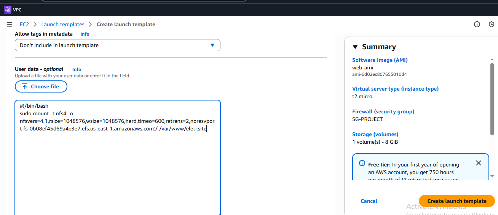  
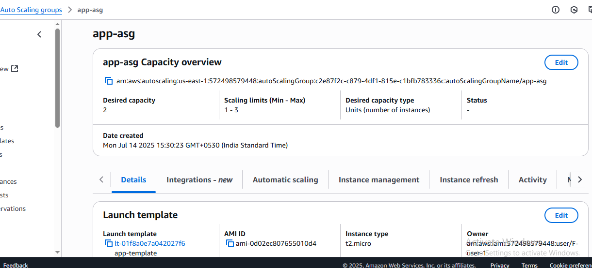

---

### 6️ Application Load Balancer (ALB)

- Created ALB in public subnets
- Forwarded traffic to Auto Scaling Group via Target Group
- Verified DNS endpoint

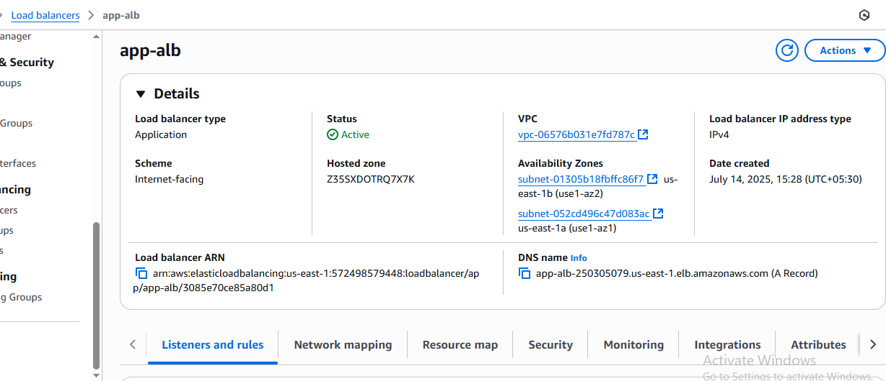

---

### 7️ S3 + CloudFront + Route 53

- Created private S3 bucket `bucket-site-111` and uploaded `images/aws-s3.PNG`
- Created CloudFront distribution with two origins: ALB (default) and S3 (`/images/*`)
- Enabled **Origin Access Control (OAC)** for S3 access
- Issued SSL certificate using ACM for custom domain
- Created A-record in Route 53 → CloudFront DNS

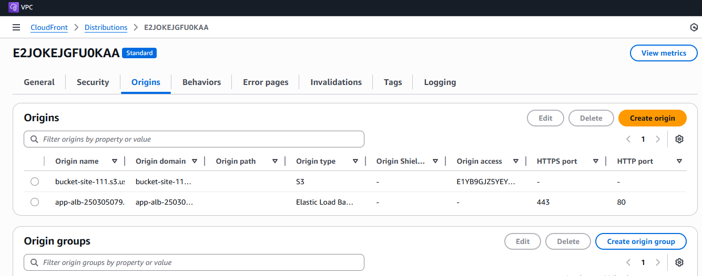  
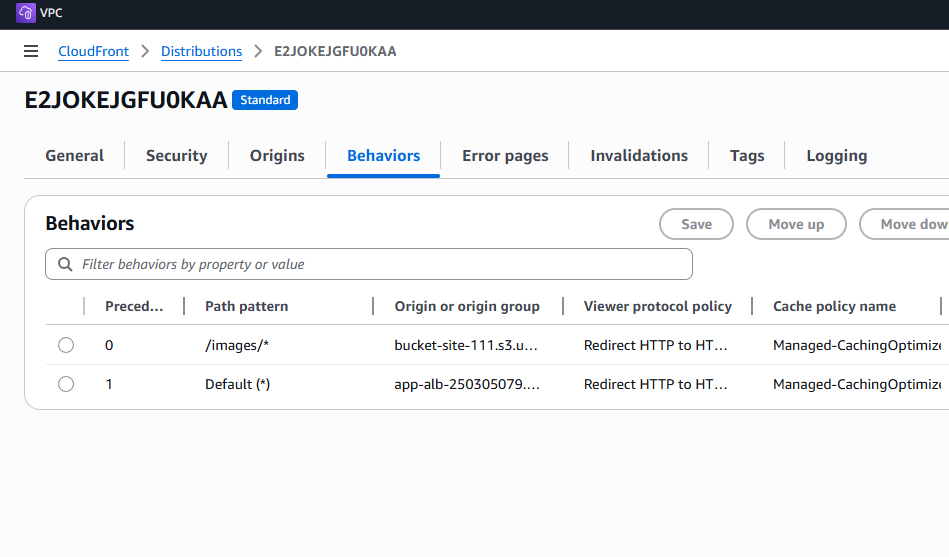  
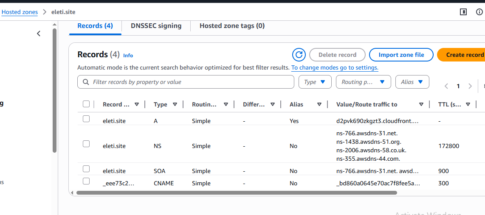

---

##  Final Output

- Web page served from EC2 with content in EFS
- Image assets delivered securely from S3 via CloudFront
- End-to-end HTTPS via ACM + Route 53 DNS routing

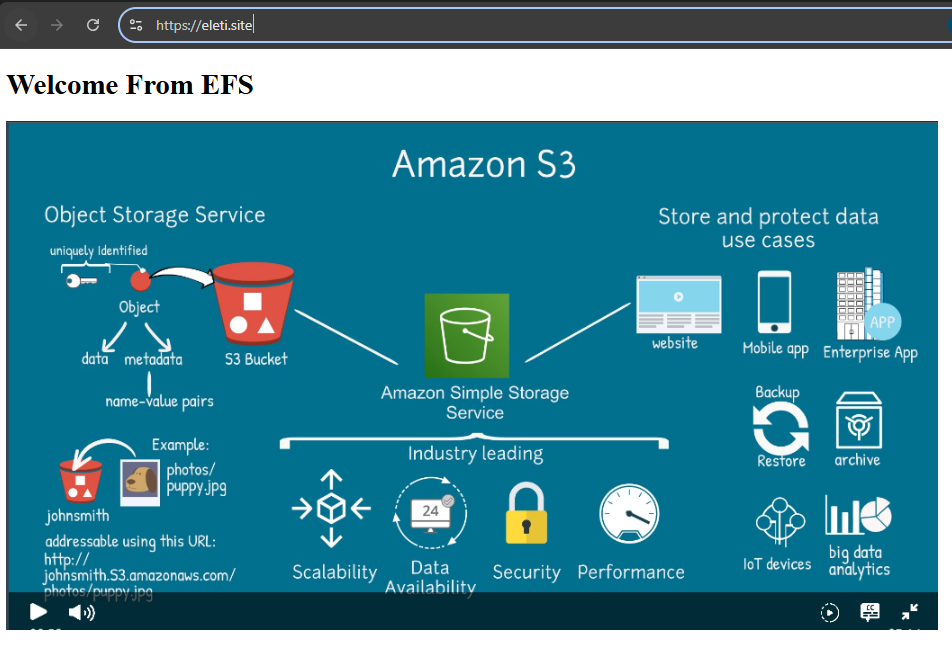

---

##  Learning Outcomes

- Built production-style 3-tier AWS architecture
- Integrated ALB, EC2 scaling, EFS mount, RDS replica
- Delivered content via CloudFront + Route 53 DNS
- Practiced IAM, networking, monitoring, and CDN

---

